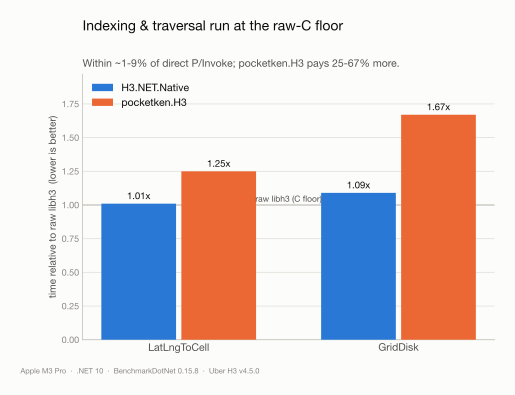
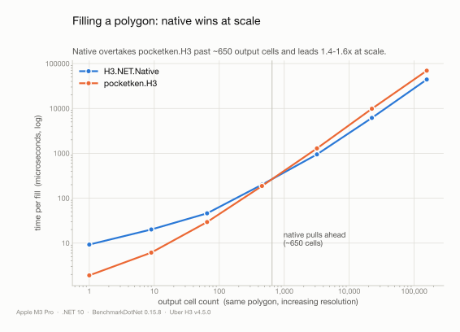
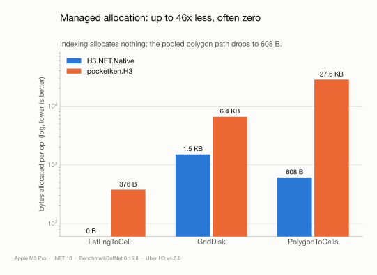

# Benchmarks

These numbers exist to answer one question for teams evaluating H3 on .NET: **what
do you give up, and what do you gain, by binding the official Uber H3 C library
instead of running a managed port?**

Every measurement below is produced by the in-repo benchmark project with
[BenchmarkDotNet](https://benchmarkdotnet.org), comparing three implementations on
identical inputs:

- **Raw libh3 C** — direct P/Invoke into the bundled native `libh3`, no idiomatic
  layer. It is the *floor*: the fastest the C code can be called from .NET, and the
  baseline that isolates this binding's own marshalling overhead.
- **H3.NET.Native** — this binding.
- **[pocketken.H3](https://github.com/pocketken/H3.net)** 4.0.0 — the fully managed
  (NetTopologySuite-based) port, the managed library many teams run today.

Absolute timings vary by hardware; **ratios are the stable signal**. The runs shown
here are Apple M3 Pro, .NET 10, BenchmarkDotNet 0.15.8, `DefaultJob`, against Uber H3
v4.5.0.

## Indexing and grid traversal run at the raw-C floor

| Operation | Implementation | Mean | vs raw libh3 | Allocated |
| --- | --- | ---: | ---: | ---: |
| `latLngToCell` | raw libh3 | 195 ns | 1.00x | – |
| `latLngToCell` | **H3.NET.Native** | 196 ns | **1.01x** | **0 B** |
| `latLngToCell` | pocketken.H3 | 243 ns | 1.25x | 376 B |
| `gridDisk` | raw libh3 | 1,025 ns | 1.00x | – |
| `gridDisk` | **H3.NET.Native** | 1,115 ns | **1.09x** | 1,504 B |
| `gridDisk` | pocketken.H3 | 1,709 ns | 1.67x | 6,576 B |

The binding adds 1–9% over calling the C directly — the cost of the safe, idiomatic,
exception-mapped surface — and stays well ahead of the managed port, which pays
25–67% more and allocates on every call.



## Filling polygons: `polygonToCells`

This is the one operation where a single headline number misleads. On a **small**
polygon the native binding loses — but the reason is structural, and it inverts as
the polygon grows.

Stable libh3 sizes its internal working buffer from the polygon's **bounding box**,
not from the number of cells produced, and zeroes that buffer before filling. On a
tiny polygon that fixed setup dominates, so a res-9, ~55-cell triangle looks like
this:

| Polygon | Implementation | Mean | Ratio | Allocated |
| --- | --- | ---: | ---: | ---: |
| res-9 triangle (~55 cells) | H3.NET.Native | 98.8 µs | 1.00 | 608 B |
| res-9 triangle (~55 cells) | pocketken.H3 | 35.2 µs | 0.36 | 28,232 B |

But that fixed cost amortizes as the fill grows. Sweeping one fixed ~0.5° box over
increasing resolution — so the output climbs from 1 cell to 156k — shows the real
picture: pocketken.H3 wins on tiny outputs, the two cross at roughly **650 cells**,
and the native binding leads by **~1.4–1.6x** from there on, while allocating
**~19–46x less at every point**.

| Resolution | Output cells | H3.NET.Native | pocketken.H3 | Faster | Native alloc | pocketken alloc |
| ---: | ---: | ---: | ---: | :--- | ---: | ---: |
| 4 | 1 | 9.3 µs | 1.9 µs | pocketken 4.9x | 192 B | 3.6 KB |
| 5 | 9 | 20.1 µs | 6.1 µs | pocketken 3.3x | 256 B | 7.6 KB |
| 6 | 65 | 46.0 µs | 29.4 µs | pocketken 1.6x | 704 B | 31 KB |
| 7 | 455 | 200.2 µs | 187.1 µs | pocketken 1.1x | 3.8 KB | 174 KB |
| 8 | 3,189 | 946.1 µs | 1,286.8 µs | **native 1.4x** | 25 KB | 1.1 MB |
| 9 | 22,334 | 6,150 µs | 9,842 µs | **native 1.6x** | 179 KB | 7.8 MB |
| 10 | 156,334 | 44,132 µs | 69,463 µs | **native 1.6x** | 1.2 MB | 57 MB |



Most real region-fill workloads (covering a neighborhood, tile, or service area at a
useful resolution) sit well above the crossover — the regime where the native binding
is both faster and dramatically lighter on the GC.

> Note: pocketken.H3 and libh3 do not always agree on the exact boundary cells of a
> fill (this binding matches libh3 exactly; investigating the pocketken delta is
> tracked separately). The sweep above compares wall-clock on the same input, not
> cell-set equality.

## Allocation

Managed allocation is where the native path wins universally: raw libh3 and the
binding's indexing path allocate **nothing**, and the pooled polygon path drops to
608 B (down 25x from a prior naive buffer). pocketken.H3 allocates on every operation.



## Correctness and provenance

Performance only matters if the results are right. Because the binding calls the
official Uber H3 C code directly rather than reimplementing it, its outputs *are* the
reference outputs. A differential test corpus — generated from the official library
via `h3-py` ≥ 4 (pinned to the bundled v4.5.0), with `h3-go` as a tiebreaker —
confirms the marshalling layer preserves them across every supported platform:
**37,454 assertions at time of writing, zero tolerated failures**. Cell and index
results match exactly; geometric measures (areas, lengths) match within a tight
floating-point tolerance that accounts for per-platform `libm`. A pure-C `valgrind`
harness guards native memory usage.

For supply-chain review, each release ships a [CycloneDX](https://cyclonedx.org) SBOM
and a signed build-provenance attestation, and is published to nuget.org via **OIDC
trusted publishing** (no long-lived API keys).

## Reproducing these numbers

Run the full suite (all categories, `DefaultJob`):

```sh
dotnet run --project tests/H3.NET.Native.Benchmarks -c Release -- --filter '*'
```

BenchmarkDotNet writes CSV and Markdown reports under
`BenchmarkDotNet.Artifacts/results/`. The charts on this page are regenerated from
those results by `tools/gen-benchmark-charts/generate_charts.py` (see its header for
the exact steps). Benchmarks are informational and never gate CI — a tiny dry-run
smoke runs there only to keep them building and runnable — and their shapes may
change while the binding is in preview.
